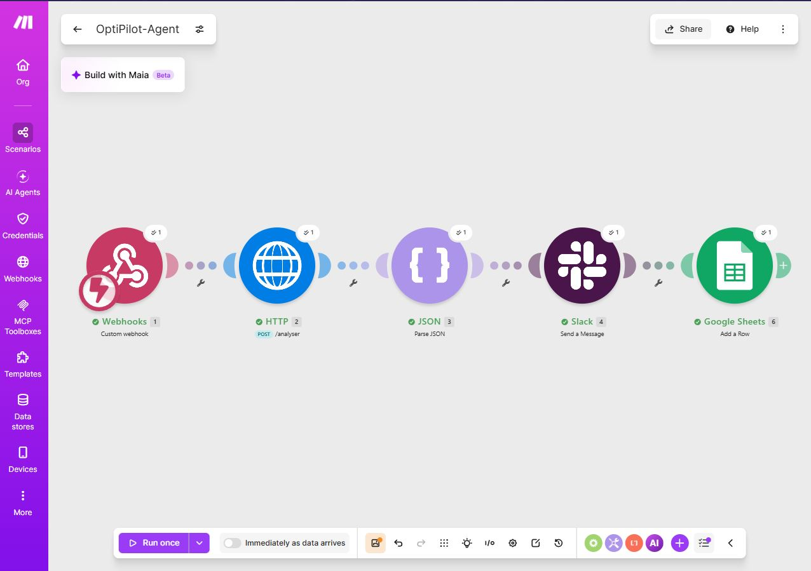

# 🧭 OptiPilot-Agent

**L'agent qui transforme une note vocale d'un responsable en cahier des charges Ops exploitable — en quelques secondes, pas en quelques jours.**
Le workflow relie une note d'un responsable → OptiPilot-Agent → Slack / Google Sheets.

🔗 **Démo interactive :**

### Démo live : [Tester le formulaire OptiPilot](https://tally.so/r/yPODX4)

### Agent-API déployé : [OptiPilot-Agent API](https://optipilot-agent-api.onrender.com/docs)

### Code : [dépôt GitHub](https://github.com/HJuddith/OptiPilot-Agent)

### Automatisation : [Workflow Make](https://eu1.make.com/public/shared-scenario/oJmiTsAxSTd/opti-pilot-agent)

#### 📖 Documentation complète des scénarios : [Workflow Make](docs/WORKFLOW_MAKE.md)

### Distribution : [Canal Slack](https://app.slack.com/client/T07KV2SSAE6/C0C2K1L8FHT)

### Base historique : [Google Sheets](https://docs.google.com/spreadsheets/d/14hZJsGDaJTAQZ6JnFPJCkfN4uXfCMMMMYipmG--CZeM/edit?gid=0#gid=0)




> Projet portfolio conçu pour illustrer concrètement le poste **Tech Ops / AI Builder** :
> cadrer un besoin IA flou, le structurer en workflow actionnable, et le restituer de façon
> pédagogique à une direction non-technique.

---

## 🎯 Pourquoi OptiPilot-Agent ?

Dans une entreprise, un responsable a des idées d'automatisation en continu — souvent
lancées entre deux réunions, sous forme de note vocale ou de phrase improvisée. Le problème n'est
jamais l'idée : c'est le temps de traduction entre _l'intention du responsable_ et _un ticket que les Ops
peuvent exécuter_.

**OptiPilot-Agent comble ce trou** :

| Sans OptiPilot-Agent                                            | Avec OptiPilot-Agent                                       |
| --------------------------------------------------------------- | ---------------------------------------------------------- |
| Note vocale perdue dans les mémos                               | Directive structurée en < 1 minute                         |
| Le responsable doit reformuler pour les Ops                     | Cahier des charges technique généré automatiquement        |
| Les Ops interprètent l'urgence "au feeling"                     | Urgence / complexité / gain de temps estimés objectivement |
| Retour au responsable en langage technique                      | Notification Slack vulgarisée, avec actions de validation  |
| Angle mort RGPD sur les données QVT (Qualité de Vie au Travail) | Détection systématique des risques données sensibles       |

Ce PoC (Proof of Concept) démontre exactement les compétences attendues sur le poste : **cadrage des besoins IA,
structuration de workflows, évangélisation par la pédagogie, et prise en compte native des enjeux
RGPD propres à une entreprise de santé mentale / QVT.**

---

## 🏗️ Architecture

```
┌──────────────────────┐
│  Note vocale / texte │
│     du responsable   │
└───────────┬──────────┘
            │
            ▼
┌───────────────────────────────────┐
│   OptiPilot-Agent (main.py)       │
│  ┌─────────────────────────────┐  │
│  │ 1. Prompt système strict    │  │
│  │ 2. Appel LLM (Groq/Mistral) │  │
│  │ 3. Parsing & validation JSON│  │
│  └─────────────────────────────┘  │
└───────────┬───────────────────────┘
            │  JSON structuré (contrat d'interface)
            ▼
┌────────────────────────────────────────────┐
│   Sortie exploitable en aval               │
│  • strategic_analysis  → pilotage / prio   │
│  • cahier_des_charges  → ticket Ops        │
│  • prompt_systeme      → agent d'exécution │
│  • notification        → Slack / Email     │
└───────────┬────────────────────────────────┘
            │  (webhook HTTP)
            ▼
┌──────────────────────────────────┐
│   API FastAPI (api.py)           │
│   Déployée sur Render            │
│   POST /analyser                 │
└───────────┬──────────────────────┘
            │
            ▼
┌──────────────────────────────────┐
│   Make.com                       │
│  Slack Block Kit • Google Sheets │
│  Gmail • Suivi automatisé        │
└──────────────────────────────────┘
```

---

## 🛠️ Stack technique

| Composant             | Choix                                       | Justification                                             |
| --------------------- | ------------------------------------------- | --------------------------------------------------------- |
| Langage               | Python 3.10+                                | Léger, lisible, standard en Ops / IA                      |
| LLM principal         | Groq (`openai/gpt-oss-120b`)                | Fiabilité du suivi d'instructions JSON strict             |
| LLM fallback          | Mistral Large (API Mistral, hébergement UE) | Option souveraine pour données sensibles QVT              |
| API webhook           | FastAPI + Uvicorn                           | Auto-doc Swagger, validation Pydantic, déploiement simple |
| Hébergement           | Render (free tier)                          | Zéro configuration, redéploiement auto sur `git push`     |
| Orchestration prévue  | Make.com                                    | Cœur du poste : sans code pour les Ops, webhook-ready     |
| Interface pédagogique | Slack Block Kit / Email HTML                | Restitution vulgarisée pour un responsable non-tech       |
| Format d'échange      | JSON strict, schéma versionné               | Contrat d'interface stable entre l'agent et les workflows |

---

## 🔄 Le workflow sur Make

```
┌──────────────────────────────┐
│  Utilisateur (responsable)   │
│  Remplit le formulaire Tally │
└───────────────┬──────────────┘
                │
                ▼
┌──────────────────────────────┐
│  Tally                       │
│  Envoie les données à Make   │
└───────────────┬──────────────┘
                │  webhook
                ▼
┌──────────────────────────────┐
│  Make — Module HTTP          │
│  POST /analyser              │
└───────────────┬──────────────┘
                │  appel HTTP
                ▼
┌──────────────────────────────┐
│  API FastAPI sur Render      │
│  https://optipilot-agent-    │
│  api.onrender.com/analyser   │
└───────────────┬──────────────┘
                │  JSON
                ▼
┌──────────────────────────────┐
│  Make — JSON Parse (envoie)  │
│  → Slack + Google Sheets     │
└──────────────────────────────┘
```

Le workflow est **duplicable sur les 5 pôles** (Sales, Marketing, Ops, RH, Finance) sans
réécrire l'orchestration : l'API expose un contrat JSON stable, chaque scénario Make n'a qu'à
consommer les champs qui l'intéressent.

---

## 🚀 Installation et exécution rapide

### En local (mode CLI)

```bash
# 1. Installer les dépendances
pip install -r requirements.txt

# 2. Copier la config (aucune clé requise pour tester en mode démo)
cp .env.example .env

# 3. Lancer l'agent sur l'exemple fourni
python main.py --input samples/input_note_resp.txt --provider demo
```

**Pour utiliser un vrai LLM** plutôt que le mode démo, renseigne `GROQ_API_KEY` (ou
`MISTRAL_API_KEY`) dans `.env`, puis :

```bash
# Avec Groq (openai/gpt-oss-120b)
python main.py --input samples/input_note_resp.txt --provider groq --output resultat.json

# Avec Mistral (option souveraine UE)
python main.py --input samples/input_note_resp.txt --provider mistral --output resultat.json
```

### Via l'API (mode webhook, pour Make / n8n)

```bash
# Démarrer l'API en local
uvicorn api:app --reload --port 8000

# Tester l'endpoint
curl -X POST http://localhost:8000/analyser \
  -H "Content-Type: application/json" \
  -d '{"note":"Test de directive","provider":"demo"}'
```

Puis ouvre **http://localhost:8000/docs** pour l'interface Swagger interactive.

**En production**, l'API est déployée sur Render :

```
https://optipilot-agent-api.onrender.com/analyser
```

---

## 📄 Exemple concret : note brute → résultat Ops

**Entrée** (`samples/input_note_resp.txt`) — note vocale informelle du responsable à propos de l'audit QVT :

> _"Bon euh, il faut qu'on fasse un truc sur les résultats du dernier audit QVT interne [...]_
> _il faut absolument qu'on puisse en sortir une synthèse par pôle [...] sans jamais qu'un nom de_
> _collaborateur ressorte nulle part [...] ça me remonte un résumé synthétique sur Slack pour que_
> _je valide."_

**Sortie** (`samples/output_optipilot_result.json`) — extrait :

```json
{
  "strategic_analysis": {
    "pole_cible": "RH / QVT",
    "urgence": "Haute",
    "complexite_technique": "Moyenne",
    "gain_temps_estime": "Env. 15 à 20h de relecture manuelle RH économisées",
    "risques_identifies": [
      {
        "type": "RGPD",
        "niveau": "Élevé",
        "description": "Anonymisation stricte requise avant toute analyse."
      }
    ]
  },
  "notification": {
    "canal": "Slack",
    "titre": "Synthèse Audit QVT prête à valider",
    "actions_proposees": [
      { "label": "Valider pour le Codex" },
      { "label": "Demander relecture RH" }
    ]
  }
}
```

➡️ Le JSON complet est disponible dans [`samples/output_optipilot_result.json`](samples/output_optipilot_result.json).

---

## 📁 Structure du dépôt

```
OptiPilot-Agent/
├── main.py                         # Script principal (CLI + logique LLM)
├── api.py                          # API FastAPI (webhook pour Make)
├── requirements.txt                # Dépendances Python
├── .env.example                    # Template de configuration
├── .gitignore
├── README.md
├── assets/                         # Captures d'écran (API, Make, Slack, Sheets)
├── docs/
│   └── CAHIER_DES_CHARGES.md       # Spécifications complètes du PoC
└── samples/
    ├── input_note_resp.txt         # Exemple de note brute du responsable
    └── output_optipilot_result.json # Exemple de résultat structuré
```

---

## 🔒 Sécurité & bonnes pratiques

Dès la première version de l'API, plusieurs garde-fous ont été mis en place :

| Mesure                                           | Objectif                                           |
| ------------------------------------------------ | -------------------------------------------------- |
| Limite de taille sur `note` (20 000 caractères)  | Anti-DoS                                           |
| Vérification de taille en entrée/sortie          | Éviter les abus mémoire                            |
| Refus d'écriture hors du répertoire courant      | Path traversal                                     |
| Messages d'erreur génériques côté client         | Ne jamais exposer de secrets dans les logs publics |
| Clés API uniquement en variables d'environnement | Aucune clé dans le code ou le dépôt                |
| Timeouts explicites sur les appels LLM           | Éviter les blocages indéfinis                      |

---

## 💡 Impact métier & vision Tech Ops

**Santé mentale et bienveillance dans le ton.** Le prompt système impose explicitement un ton
factuel et bienveillant dans les notifications générées — cohérent avec le fait qu'une entreprise
de QVT s'adresse à des équipes dans un contexte de santé mentale au travail. Un agent qui
"évangélise" l'IA dans ce type d'entreprise doit d'abord démontrer qu'il respecte cette sensibilité,
pas seulement la performance technique.

**Pédagogie pour les non-tech.** La sortie de l'agent sépare volontairement le _technique_ (cahier
des charges, prompt système) du _vulgarisé_ (notification Slack). C'est la même logique que
d'expliquer un workflow Make à un collègue RH ou Sales sans jargon : rendre l'IA compréhensible,
pas juste fonctionnelle.

**RGPD comme réflexe, pas comme case à cocher.** Le cas d'usage démonstrateur choisi
(anonymisation d'un audit QVT) n'est pas anodin : il force le pipeline à intégrer la
minimisation des données et la détection de risque _dans le code_, avant tout appel LLM —
exactement le type de garde-fou attendu pour manipuler des données de santé mentale / QVT.

**Passage à l'échelle Ops.** Le JSON de sortie est pensé comme un **contrat d'interface stable**
: n'importe quel scénario Make ou workflow n8n peut le consommer via un simple module HTTP/Webhook,
sans dépendre du prompt engineering sous-jacent. C'est ce qui permettrait de dupliquer ce pattern
sur les 5 pôles (Sales, Marketing, Ops, RH, Finance) sans réécrire l'orchestration à chaque fois.

---

## 🎓 Ce que j'ai appris

- **Migration LLM en production.** Le retrait du modèle `llama-3.3-70b-versatile` par Groq
  (16 août 2026) m'a obligé à mettre en place une gestion de modèle par variable d'environnement
  (`GROQ_MODEL`), pour pouvoir basculer sans redéployer le code. Leçon : ne jamais hardcoder un
  nom de modèle dans le code.
- **Contrat d'interface JSON.** Définir un schéma strict en amont m'a évité de casser le workflow
  Make à chaque évolution du prompt. Le code peut changer, le contrat reste.
- **Sécurité dès le PoC.** Limite de taille d'entrée, refus d'écriture hors cwd, messages
  d'erreur génériques côté client : des réflexes à appliquer dès la première version, pas en
  rustine après coup.
- **Cold start en free tier.** Découverte du comportement de Render : le service s'endort
  après 15 min d'inactivité. Impact réel sur les webhooks qui ont un timeout court.

---

## ⚠️ Limites connues du PoC

- **Cold start Render (free tier).** 30 à 60 secondes après 15 minutes d'inactivité. Contourné
  en prod par un ping régulier sur `/health`, ou en passant au tier payant.
- **Anonymisation côté LLM uniquement.** La détection RGPD est faite par le prompt, pas par un
  NER local. Un vrai passage en production exigerait un pré-traitement local.
- **Boutons Slack non interactifs.** Les actions proposées sont affichées, mais les clics ne
  déclenchent pas encore d'endpoint. Voir roadmap.
- **Quotas Groq gratuits.** 1 000 requêtes/jour — suffisant pour un PoC, pas pour un usage réel.
- **Mono-tenant.** Un seul canal Slack, un seul Google Sheet. La version multi-pôles est
  envisagée mais pas implémentée.

---

## ⚠️ Limites assumées & roadmap

Ce Proof of Concept valide la chaîne complète d'orchestration. Certains éléments restent
volontairement hors scope pour ne pas sur-complexifier la démo :

### ✅ Déjà livré

- [x] CLI `main.py` — providers `demo` / `groq` / `mistral`
- [x] API FastAPI (`POST /analyser`) exposée en webhook
- [x] Déploiement Render (free tier)
- [x] Prompt système strict avec détection RGPD native
- [x] Règle anti-noms propres (conformité RGPD)
- [x] Sécurisation de l'API (limites, path traversal, erreurs génériques)
- [x] Workflow Make : Tally → HTTP → JSON Parse → Slack → Google Sheets
- [x] Formulaire Tally utilisable par des profils non-tech
- [x] Notification Slack vulgarisée avec actions proposées et formule de clôture
- [x] Archivage automatique des directives dans Google Sheets

### 🚧 En cours — Limites assumées du PoC

| Limite                               | Raison                                                                                    |
| ------------------------------------ | ----------------------------------------------------------------------------------------- |
| **Boutons Slack non interactifs**    | Nécessite une Slack App complète (Interactivity + endpoint `/actions`), hors scope du PoC |
| **Pas de transcription vocale**      | Le PoC prend du texte en entrée. Whisper serait la prochaine brique                       |
| **Anonymisation côté LLM seulement** | Pas de NER local en amont                                                                 |
| **Mono-tenant**                      | Un seul canal Slack, un seul Google Sheet                                                 |
| **Cold start Render (free tier)**    | 30-60 s après inactivité — limite plateforme                                              |

### 🔮 Au-delà du PoC

- [ ] Anonymisation locale (regex + NER léger) avant appel LLM
- [ ] Tableau de bord historique (Metabase ou Looker Studio)
- [ ] Multi-tenant : un canal Slack par pôle, un Sheet par pôle
- [ ] Tests automatisés (pytest + GitHub Actions)
- [ ] Rate limiting applicatif côté API

---

## 🧪 Tests

```bash
# Vérification syntaxe
python -m py_compile main.py api.py

# Lint
python -m ruff check main.py api.py

# Test manuel API en local
uvicorn api:app --reload --port 8000
curl -X POST http://localhost:8000/analyser \
  -H "Content-Type: application/json" \
  -d '{"note":"Test","provider":"demo"}'

# Test API en production
curl -X POST https://optipilot-agent-api.onrender.com/analyser \
  -H "Content-Type: application/json" \
  -d '{"note":"Test","provider":"demo"}'
```

---

_Projet réalisé dans le cadre d'un apprentissage au poste de Tech Ops / AI Builder._
