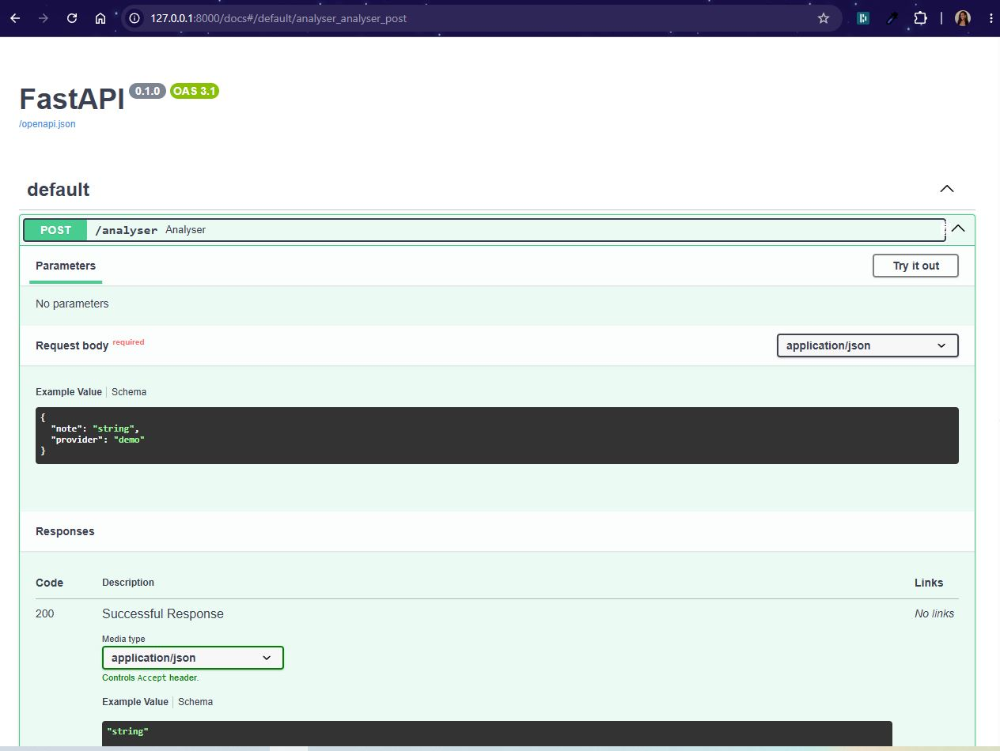

# 🧭 OptiPilot-Agent

**L'agent qui transforme une note vocale d'un responsable en cahier des charges Ops exploitable — en quelques secondes, pas en quelques jours.**
Le workflow relie une note d'un responsable → OptiPilot-Agent → Slack/Google Sheets.

🔗 **Démo :** _à compléter après déploiement_ · **Code :** [_lien du dépôt_](https://github.com/HJuddith/OptiPilot-Agent)




-FF7000>)


> Projet portfolio conçu pour illustrer concrètement le poste **Tech Ops / AI Builder** :
> cadrer un besoin IA flou, le structurer en workflow actionnable, et le restituer de façon
> pédagogique à une direction non-technique.

---

## 🎯 Pourquoi OptiPilot-Agent ?

Dans une entreprise, un responsable a des idées d'automatisation en continu — souvent
lancées entre deux réunions, sous forme de note vocale ou de phrase improvisée. Le problème n'est
jamais l'idée : c'est le temps de traduction entre _l'intention du responsable_ et _un ticket que les Ops
peuvent exécuter_.

**OptiPilot-Agent comble ce trou** :

| Sans OptiPilot-Agent                                            | Avec OptiPilot-Agent                                       |
| --------------------------------------------------------------- | ---------------------------------------------------------- |
| Note vocale perdue dans les mémos                               | Directive structurée en < 1 minute                         |
| Le responsable doit reformuler pour les Ops                     | Cahier des charges technique généré automatiquement        |
| Les Ops interprètent l'urgence "au feeling"                     | Urgence / complexité / gain de temps estimés objectivement |
| Retour au responsable en langage technique                      | Notification Slack vulgarisée, avec actions de validation  |
| Angle mort RGPD sur les données QVT (Qualité de Vie au Travail) | Détection systématique des risques données sensibles       |

Ce PoC (Proof of Concept) démontre exactement les compétences attendues sur le poste : **cadrage des besoins IA,
structuration de workflows, évangélisation par la pédagogie, et prise en compte native des enjeux
RGPD propres à une entreprise de santé mentale/QVT.**

---

## 🏗️ Architecture

```
┌──────────────────────┐
│  Note vocale / texte  │
│      du responsable   │
└───────────┬───────────┘
            │
            ▼
┌──────────────────────────────────┐
│   OptiPilot-Agent (main.py)      │
│  ┌─────────────────────────────┐ │
│  │ 1. Prompt système strict    │ │
│  │ 2. Appel LLM (Claude/Mistral)│ │
│  │ 3. Parsing & validation JSON│ │
│  └─────────────────────────────┘ │
└───────────┬───────────────────────┘
            │  JSON structuré (contrat d'interface)
            ▼
┌──────────────────────────────────────────┐
│   Sortie exploitable en aval              │
│  • strategic_analysis  → pilotage/priorisation │
│  • cahier_des_charges  → ticket Ops        │
│  • prompt_systeme      → agent d'exécution │
│  • notification        → Slack / Email     │
└───────────┬────────────────────────────────┘
            │  (webhook HTTP)
            ▼
┌──────────────────────────────────┐
│   Make.com / n8n                  │
│  Slack Block Kit • Google Sheets  │
│  Gmail • Suivi automatisé         │
└────────────────────────────────────┘
```

## 🛠️ Stack technique

| Composant             | Choix                                       | Justification                                             |
| --------------------- | ------------------------------------------- | --------------------------------------------------------- |
| Langage               | Python 3.10+                                | Léger, lisible, standard en Ops/IA                        |
| LLM principal         | Claude Sonnet 5 (API Anthropic)             | Fiabilité du suivi d'instructions JSON strict             |
| LLM fallback          | Mistral Large (API Mistral, hébergement UE) | Option souveraine pour données sensibles QVT              |
| Orchestration prévue  | Make.com ou n8n                             | Cœur du poste : sans code pour les Ops, webhook-ready     |
| Interface pédagogique | Slack Block Kit / Email HTML                | Restitution vulgarisée pour un responsable non-tech       |
| Format d'échange      | JSON strict, schéma versionné               | Contrat d'interface stable entre l'agent et les workflows |

---

## 🚀 Installation et exécution rapide

```bash
# 1. Installer les dépendances
pip install -r requirements.txt

# 2. Copier la config (aucune clé requise pour tester en mode démo)
cp .env.example .env

# 3. Lancer l'agent sur l'exemple fourni
python main.py --input samples/input_note_resp.txt --provider demo
```

Pour utiliser un vrai LLM plutôt que le mode démo, renseigner `ANTHROPIC_API_KEY` (ou
`MISTRAL_API_KEY`) dans `.env`, puis :

```bash
python main.py --input samples/input_note_resp.txt --provider claude --output resultat.json
```

---

## 📄 Exemple concret : note brute → résultat Ops

**Entrée** (`samples/input_note_resp.txt`) — note vocale informelle du responsable à propos de l'audit QVT :

> _"Bon euh, il faut qu'on fasse un truc sur les résultats du dernier audit QVT interne [...]
> il faut absolument qu'on puisse en sortir une synthèse par pôle [...] sans jamais qu'un nom de
> collaborateur ressorte nulle part [...] ça me remonte un résumé synthétique sur Slack pour que
> je valide."_

**Sortie** (`samples/output_optipilot_result.json`) — extrait :

```json
{
  "strategic_analysis": {
    "pole_cible": "RH / QVT",
    "urgence": "Haute",
    "complexite_technique": "Moyenne",
    "gain_temps_estime": "Env. 15 à 20h de relecture manuelle RH économisées",
    "risques_identifies": [
      {
        "type": "RGPD",
        "niveau": "Élevé",
        "description": "Anonymisation stricte requise avant toute analyse."
      }
    ]
  },
  "notification": {
    "canal": "Slack",
    "titre": "Synthèse Audit QVT prête à valider",
    "actions_proposees": [
      { "label": "Valider pour le Codex" },
      { "label": "Demander relecture RH" }
    ]
  }
}
```

➡️ Le JSON complet est disponible dans [`samples/output_optipilot_result.json`](samples/output_optipilot_result.json).

---

## 📁 Structure du dépôt

```
OptiPilot-Agent/
├── main.py      # Script principal
├── api.py
├── assets       # Captures d'ecran de l'api, scénario make, google sheet, ....
├── requirements.txt                 # Dépendances Python
├── .env.example                     # Template de configuration
├── .gitignore
├── README.md
├── docs/
│   ├── CAHIER_DES_CHARGES.md        # Spécifications complètes du PoC (Proof of Concept)
└── samples/
    ├── input_note_resp.txt            # Exemple de note brute du duresponsable
    └── output_optipilot_result.json # Exemple de résultat structuré
```

---

## 💡 Impact métier & vision Tech Ops

**Santé mentale et bienveillance dans le ton.** Le prompt système impose explicitement un ton
factuel et bienveillant dans les notifications générées — cohérent avec le fait que Qualisocial
s'adresse à des équipes dans un contexte de santé mentale au travail. Un agent qui "évangélise"
l'IA dans ce type d'entreprise doit d'abord démontrer qu'il respecte cette sensibilité, pas
seulement la performance technique.

**Pédagogie pour les non-tech.** La sortie de l'agent sépare volontairement le _technique_ (cahier
des charges, prompt système) du _vulgarisé_ (notification Slack). C'est la même logique que
d'expliquer un workflow Make à un collègue RH ou Sales sans jargon : rendre l'IA compréhensible,
pas juste fonctionnelle.

**RGPD comme réflexe, pas comme case à cocher.** Le cas d'usage démonstrateur choisi
(anonymisation d'un audit QVT) n'est pas anodin : il force le pipeline à intégrer la
minimisation des données et la détection de risque _dans le code_, avant tout appel LLM —
exactement le type de garde-fou attendu pour manipuler des données de santé mentale/QVT.

**Passage à l'échelle Ops.** Le JSON de sortie est pensé comme un **contrat d'interface stable**
: n'importe quel scénario Make ou workflow n8n peut le consommer via un simple module HTTP/Webhook,
sans dépendre du prompt engineering sous-jacent. C'est ce qui permettrait de dupliquer ce pattern
sur les 5 pôles (Sales, Marketing, Ops, RH, Finance) sans réécrire l'orchestration à chaque fois.

---

## 🗺️ Roadmap (au-delà du PoC)

- [ ] API FastAPI autour de `main.py` pour exposition en webhook direct (Make → HTTP POST)
- [ ] Boutons Slack réellement interactifs (Slack Interactivity + endpoint d'écoute des actions)
- [ ] Historique des directives traitées dans Google Sheets (tableau de bord pour le responsable)
- [ ] Anonymisation locale (regex + NER léger) en amont de l'appel LLM, pour renforcer le principe
      de minimisation des données avant tout envoi externe

---

_Projet réalisé dans le cadre d'un apprentissage au poste de Tech Ops / AI Builder._
